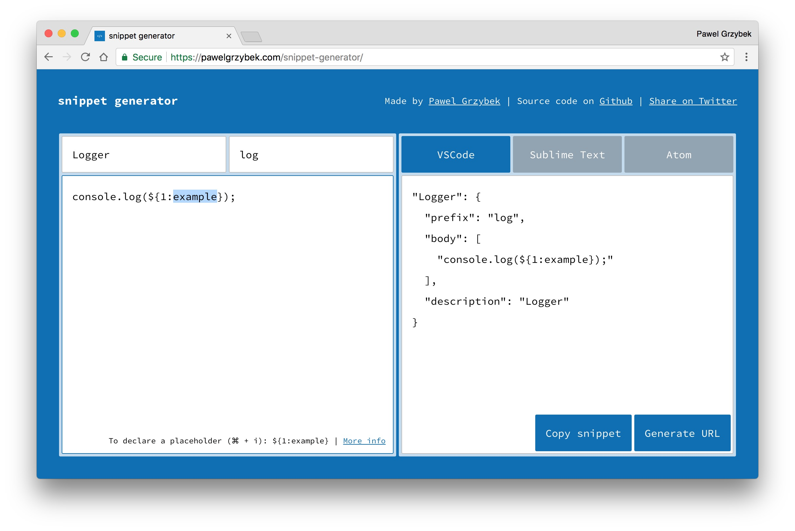

# snippet generator

[Snippet generator](https://snippet-generator.app/) is a tiny React app to help you create [Visual Studio Code](https://code.visualstudio.com/), [Sublime Text](https://www.sublimetext.com/) and [Atom](https://atom.io/) snippets.

I built it for fun. It is hosted on Netlify for free (thanks Netlify). The only thing that I pay money for is a domain name (snippet-generator.app). If you enjoy using snippet generator, [help me to renew this domain please](https://paypal.me/pools/c/8p6yWl7QVT).

Enjoy!

